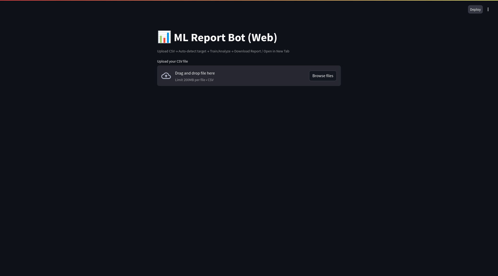

# 📊 ML Report Bot

> **An automated Machine Learning assistant that analyzes your CSV data, trains models, and generates beautiful HTML reports.**



## 🚀 Features

*   **Smart Analysis**: Automatically detects target columns and suggests the best model.
*   **Unsupervised Learning**: Can perform **Clustering (K-Means)** if no target is provided.
*   **Visual Reports**: Generates detailed HTML reports with:
    *   Confusion Matrix & Accuracy metrics.
    *   Feature Importance charts.
    *   Actual vs Predicted graphs.
*   **Data Validation**: Automatically checks if your CSV is valid for training.
*   **One-Click Docker**: Run the entire stack with a single command.

---

## 🛠️ Installation & Setup (Local)

If you want to run the project on your own computer without Docker, follow these steps.

### Prerequisites
*   Python 3.10 or higher installed.

### 1. Clone & Install
Open your terminal and run:

```bash
# 1. Create a virtual environment
python -m venv .venv

# 2. Activate it
# On Mac/Linux:
source .venv/bin/activate
# On Windows:
# .venv\Scripts\activate

# 3. Install dependencies
pip install -r requirements.txt
```

### 2. Configuration
Copy the example environment file:

```bash
cp .env.example .env
```
*(If you have a Gemini API Key for smart suggestions, add it to the `.env` file)*

### 3. Run the App
You need two terminals open (one for the backend API, one for the frontend UI).

**Terminal 1 (Backend API):**
```bash
uvicorn app.main:app --reload
```
You should see: `Uvicorn running on http://127.0.0.1:8000`

**Terminal 2 (Frontend UI):**
```bash
streamlit run ui/app.py
```
This will automatically open the app in your browser at `http://localhost:8501`.

---

## 🐳 Running with Docker (Recommended)

The easiest way to run the project. You don't need to install Python manually.

1.  Make sure you have **Docker** and **Docker Compose** installed.
2.  Run this command in the project folder:

```bash
docker-compose up --build
```

3.  Open your browser and go to:
    *   **App**: [http://localhost:8501](http://localhost:8501)
    *   **API Docs**: [http://localhost:8000/docs](http://localhost:8000/docs)

---

## 📸 Screenshots

### Report Output

*(Place a screenshot of the generated HTML report here)*


---

## 🧪 Running Tests

This project includes automated tests to ensure reliability.

```bash
# Run all tests
python -m pytest tests/
```

## 📜 License

MIT License. Free to use!
